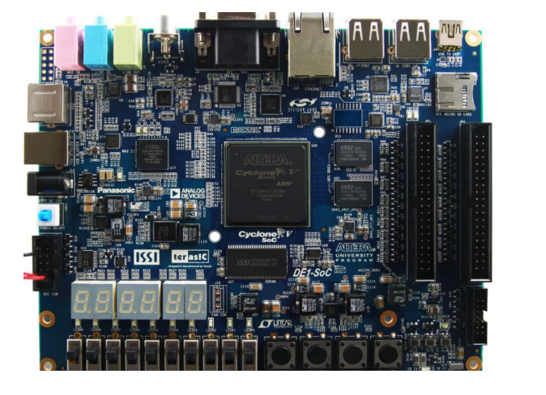

<h1 align="center"> Jogo da Velha</h1>
<h3 align="center"> O clássico Jogo da Velha, agora desenvolvido para o kit de desenvolvimento DE1-SoC utilizando linguagem C </h3>

 

 
<h2> Especificações do Projeto</h2>

O mercado de jogos movimenta bilhões anualmente, e continua sendo uma força altamente impulsionadora da economia global. Cada vez mais é observada uma alta demanda por experiências imersivas e inovadoras, que buscam cativar o público com um alto nível de tecnologia, entretanto, ainda é possível observar uma demanda pelos jogos clássicos.

Neste cenário, o clássico jogo da velha surge como um exemplo que resistiu ao tempo e continua marcando gerações. O presente projeto tem como intuito desenvolver um console que implemente uma clássica versão do atemporal jogo da velha, onde o mesmo, deve ser executado em uma interface em modo texto utilizando os recursos da placa de desenvolvimento DE1-SOC.

Os requisitos para elaboração do projeto estão descritos a seguir:

* O jogo deve permitir a interação de dois jogadores, de forma que a escolha da posição de marcação no tabuleiro em cada jogada (assim como a confirmação da jogada) deva ser captada por um mouse conectado a uma das portas USB existentes no Kit de desenvolvimento DE1-SoC.

*  O código deve ser escrito em linguagem C
*  O sistema só poderá utilizar os componentes disponíveis na placa.

O controle do jogo (iniciar, pausar, resetar, etc...), pode ser feito a partir dos botões e chaves da placa, o display de 7 segmentos e os leds também podem ser utilizados para exibição de qualquer informação, se necessário.

<h2>  Equipe:  </h2>
<uL> 
  <li><a href="https://github.com/LucaasGy">Lucas Gabriel Cerqueira Santos Lima</a></li>
  <li><a href="https://github.com/Lucas-L-Rodrigues">Lucas Lima Rodrigues</a></li>
  <li><a href="https://github.com/felipe-py">Luis Felipe Cunha Silva</a></li>
</ul>

<h1 align="center"> Sumário </h1>
      <ul>
        <li><a href="#equipamentos"> Equipamentos e Software Utilizados</a></li>
      </ul>

<h2> Equipamentos e Software Utilizados</h2>

Nesta seção, serão descritos os equipamentos e softwares utilizados para o desenvolvimento do projeto

<h3> Kit de desenvolvimento DE1-SoC</h3>

O kit de desenvolvimento DE1-SOC é construído em torno do Altera FPGA System-on-Chip (SoC), apresentando uma plataforma robusta de design de hardware que combina a lógica programável  do Intel FPGA Cyclone V com o processador  ARM cortex-A9.

  

<strong>Kit de desenvolvimento DE1-SoC</strong>

<h3> Mouse</h3>

<h3> Linguagem C</h3>

A linguagem de programação C oi utilizada para o desenvolvimento completo do projeto, ela possui uma alta eficiência de memória e desempenho, o que permite um controle preciso dos recursos do hardware, além de possuir uma fácil portabilidade e um baixo nível de abstração.

<h3> Compilador GNU</h3>

O GCC (Gnu Compiler Collection), foi utilizado na compilação do código do jogo, possui uma alta portabilidade para as mais diversas plataormas e sistemas operacionais, além de possibilitar diversas otimizações que tornam o projeto mais eficiente.

 
<h2> Arquitetura da placa DE1-SoC</h2>

 
<h2> Execução do Projeto  </h2>

Para iniciar o jogo, é necessário seguir os seguintes passos para obter o código-fonte, compilar o código em C e executá-lo em um dispositivo FPGA DE1-SoC. 

**Passo 1: Clonar o Repositório**

Abra o terminal e execute o seguinte comando para obter o código do repositório:

    git clone https://github.com/Lucas-L-Rodrigues/PBLSD.git

**Passo 2: Compilar o Código em C**

Compile e execute o código usando o comando:

    make

    make run

Para apagar arquivos gerados na compilação, use o comando:

    make clearGerados

Para apagar todos os arquivos, com exceção do Makefile, use o comando:

    make clearAll

