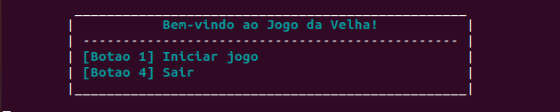
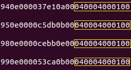
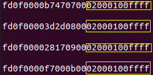
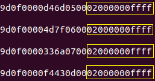
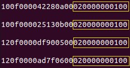
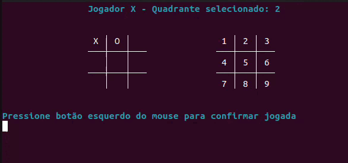
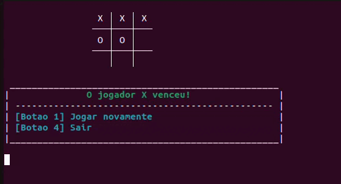

<h1 align="center"> Jogo da Velha</h1>
<h3 align="center"> O clássico Jogo da Velha, agora desenvolvido para o kit de desenvolvimento DE1-SoC utilizando linguagem C </h3>

 

 
<h2> Especificações do Projeto</h2>

O mercado de jogos movimenta bilhões anualmente, e continua sendo uma força altamente impulsionadora da economia global. Cada vez mais é observada uma alta demanda por experiências imersirvas e inovadoras, que buscam cativar o público com um alto nível de tecnologia, entretanto, ainda é possível observar uma demanda pelos jogos clássicos.

Neste cenário, o clássico jogo da velha surge como um exemplo que resistiu ao tempo e continua marcando gerações. O presente projeto tem como intuito desenvolver um console que implemente uma clássica versão do atemporal jogo da velha, onde o mesmo, deve ser executado em uma interface em modo texto utilizando os recursos da placa de desenvolvimento DE1-SOC.

Os requisitos para elaboração do projeto estão descritos a seguir:

* O jogo deve permitir a interação de dois jogadores, de forma que a escolha da posição de marcação no tabuleiro em cada jogada (assim como a confirmação da jogada) deva ser captada por um mouse conectado a uma das portas USB existentes no Kit de desenvolvimento DE1-SoC.

*  O código deve ser escrito em linguagem C.

*  O sistema só poderá utilizar os componentes disponíveis na placa.

O controle do jogo (iniciar, pausar, resetar, etc...), pode ser feito a partir dos botões e chaves da placa, o display de 7 segmentos e os leds também podem ser utilizados para exibição de qualquer informação, se necessário.

<h2>  Equipe  </h2>
<uL> 
  <li><a href="https://github.com/LucaasGy">Lucas Gabriel Cerqueira Santos Lima</a></li>
  <li><a href="https://github.com/Lucas-L-Rodrigues">Lucas Lima Rodrigues</a></li>
  <li><a href="https://github.com/felipe-py">Luis Felipe Cunha Silva</a></li>
</ul>

<h1 align="center"> Sumário </h1>

	<ul>
        <li><a href="#equipamentos">  Descrição dos Equipamentos e Software Utilizados</a></li>
        <li><a href="#arq_CPU">  Arquitetura da placa DE1-SoC</a></li>
        <li><a href="#Perifericos-utilizados"> Periféricos da Placa DE1-SoC Utilizados </a></li>
        <li><a href="#Drives"> Drives de Dispositivos de Entrada e Saída (E/S) </a></li>
        <li><a href="#interface-usuario"> Interface do Usuário </a></li>
        <li><a href="#Regras-de-jogo"> Dinâmica e Regras de Jogo </a>
        </li>
        <li><a href="#eventos-mouse"> Captando Eventos do Mouse </a></li>
        <li><a href="#movimentacao-mouse"> Movimentação do mouse X Quadrante selecionado </a></li>
        <li><a href="#solucao-geral"> Solução Geral do projeto </a></li>
        <li><a href="#testes"> Testes </a></li>
        <li><a href="#conclusao"> Conclusão </a></li>
        <li><a href="#execucaoProjeto"> Execução do Projeto </a></li>
        <li><a href="#referencias"> Referências </a></li>
	</ul>	

 
<h2> Descrição dos Equipamentos e Software Utilizados</h2>

 

Nesta seção, são apresentados os equipamentos e software utilizados durante o desenvolvimento do projeto.

<h3> O kit de desenvolvimento DE1-SoC</h3>

A placa DE1-SoC é um kit de desenvolvimento que integra um processador ARM Cortex-A9 dual-core com um FPGA Cyclone V da Intel. Este dispositivo oferece uma variedade de periféricos, como display de 7 segmentos, porta Ethernet, USB, porta de áudio, entre outros, tornando-o adequado para projetos que exigem integração de software e hardware. É comumente empregado em ambientes educacionais e de pesquisa para o estudo e desenvolvimento em sistemas embarcados e FPGA

  

<strong>Kit de desenvolvimento DE1-SoC</strong>

<h3> Mouse</h3>

PRECISA ATUALIZAR.

  

<strong>Mouse Modelo</strong>

<h3> Linguagem C</h3>

A seleção da linguagem C foi motivada por sua eficiência, portabilidade e ampla adoção em sistemas embarcados. Sua sintaxe direta proporciona um controle preciso sobre o hardware, ao passo que suas bibliotecas padrão e ferramentas simplificam o desenvolvimento de código compacto e otimizado para dispositivos com recursos limitados.

<h3> Compilador GNU</h3>

O GCC, que significa "GNU Compiler Collection" (Coleção de Compiladores GNU), é uma distribuição integrada de compiladores amplamente adotada que suporta diversas linguagens de programação, como C, C++, Objective-C, Fortran, Ada, entre outras. Ao ser executado, o GCC atravessa etapas de pré-processamento, compilação, montagem e ligação. Ele disponibiliza uma vasta variedade de opções de linha de comando para personalização, o que simplifica a configuração de acordo com as necessidades específicas do desenvolvedor.

<h3>Vscode</h3>

O Visual Studio Code, também conhecido como VSCode, é um ambiente de desenvolvimento muito popular. Desenvolvido pela Microsoft, é um editor de código aberto e gratuito que oferece recursos como realce de sintaxe, conclusão automática de código e depuração integrada. Ele suporta uma variedade de linguagens de programação e possui um sistema de extensões que permite personalizar e estender suas funcionalidades. No projeto, o VSCode foi utilizado para desenvolver o código-fonte do jogo e formatar o README.

 
<h2> Arquitetura da placa DE1-SoC</h2>

Nesta seção, será explorado a arquitetura da placa DE1-SoC, incluindo o processador ARM Cortex-A9, a estrutura de registros, o mapeamento de dispositivos de entrada/saída na memória, a memória utilizada, a comunicação entre o processador e o FPGA, e o processo de compilação nativa na placa.

<h3>Visão Geral dos Recursos do Processador ARM Cortex-A9 </h3>

O processador ARM Cortex-A9 utiliza uma arquitetura de conjunto de instruções reduzido (RISC), com operações aritméticas e lógicas realizadas nos seus registradores de uso geral. O movimento de dados entre a memória e os registradores é feito por instruções Load e Store, utilizando uma palavra de 32 bits e endereçamento de bytes no formato little-endian.

<h3>Estrutura do Registro</h3>

O processador ARM Cortex-A9 possui 15 registros de uso geral (R0 a R14), um contador de programa (R15) e um registro de status de programa atual, CPSR, todos com 32 bits. Dois registros são tratados de maneira especial: R13 é o Stack Pointer e R14 é um registro de link na ligação de sub-rotina.

  

<strong>Registradores disponíveis e sua organização interna</strong>

<h3>Instruções e Conjunto Thumb</h3>

As instruções têm 32 bits e são armazenadas na memória alinhadas em palavras. O conjunto Thumb oferece uma versão compacta com instruções de 16 bits, reduzindo os requisitos de memória, o que é vantajoso em aplicações embarcadas.

<h3>Memória</h3>

O HPS inclui uma interface de memória que conecta o ARM MPCORE a uma memória DDR3 de 1 GB. Essa memória é comumente utilizada para armazenamento de programas e dados pelos processadores ARM. A memória é organizada em 256M x 32 bits e pode ser acessada por operações de palavra (32 bits), meia-palavra e byte.

<h3>Mapeamento de Dispositivos de E/S</h3>

Os dispositivos de entrada/saída acessíveis pelo processador ARM são mapeados na memória e podem ser acessados como locais de memória através de instruções Load e Store.

<h3>Interrupções de Hardware</h3>

As interrupções de hardware podem ser geradas por dispositivos de E/S, ativando as entradas de solicitação de interrupção do processador (IRQ ou FIQ). Quando ocorre uma interrupção, o processador entra no modo de exceção correspondente e salva o estado atual do programa. O endereço salvo no registrador de link deve ser decrementado em 4 antes de retornar ao programa interrompido.

<h3>Diagrama de Blocos do Sistema DE1-SoC</h3>

O sistema DE1-SoC é composto pelo Hard Processor System (HPS) e FPGA dentro do chip Cyclone V SoC. O HPS inclui um processador dual-core ARM Cortex-A9, uma porta de memória DDR3 e dispositivos periféricos. O FPGA implementa dois processadores Intel Nios II e diversas portas periféricas.

  

<strong>Diagrama da arquitetura da placa DE1-SoC</strong>

<h3>Comunicação entre Processador e FPGA via JTAG</h3>

A porta JTAG possibilita a comunicação entre a placa DE1-SoC e o computador host, permitindo a transferência de arquivos de programação FPGA para a placa DE1-SoC e o monitoramento através do programa Intel FPGA Monitor.

<h3>Compilação Nativa na Placa DE1-SoC</h3>

A compilação nativa ocorre quando um programa é compilado em um sistema para rodar na mesma arquitetura do próprio sistema. Neste caso, a compilação nativa de programas pode ser realizada na placa DE1-SoC através da linha de comando do Linux, utilizando sua cadeia de ferramentas de compilação integrada. O comando gcc invoca o GNU C Compiler, um compilador de código aberto amplamente utilizado para compilar programas Linux, já citado anteriormente.

 
<h2> Periféricos da Placa DE1-SoC Utilizados </h2>

A seguir, será feita as descrições gerais dos periféricos utilizados da placa DE1-SoC e seus aspectos mais importantes. A Figura abaixo mostra a placa FPGA, com as indicações dos seus dispositivos que serão citados.

  

<strong> Layout dos periféricos da placa</strong>

<h3>Gigabit Ethernet</h3>

A placa suporta transferência Gigabit Ethernet por um chip externo Micrel KSZ9021RN PHY e função HPS Ethernet MAC. 

Existem dois LEDs, LED verde (LEDG) e LED amarelo (LEDY), que representam o status da Ethernet PHY (KSZ9021RNI). Os sinais de controle dos LEDs são conectados aos LEDs no conector RJ45. A conexão da placa ao Gigabit Ethernet é estabelecida quando o LEDG acende.

<h3>USB Host</h3>

A placa possui duas portas USB 2.0 tipo-A com um controlador SMSC USB3300 e um controlador de hub de 2 portas. 

O dispositivo SMSC USB3300 de 32 pinos faz interface com o controlador de hub SMSC USB2512B, hub este que permite expandir o número de portas USB disponíveis na placa, permitindo que mais dispositivos USB sejam conectados. Este dispositivo suporta UTMI+ Low Pin Interface (ULPI), que se comunica com o controlador USB 2.0 em HPS. 

O PHY, responsável por lidar com a camada física da comunicação USB, incluindo a modulação/demodulação de sinais elétricos, opera no modo Host conectando o pino ID do USB3300 ao terra. Ao operar no modo Host, o dispositivo é alimentado pelas duas portas USB tipo A.

<h3>Botões</h3>

A placa disponibiliza quatro botões para utilização. Os dados de leitura dos botões são armazenados em um registrador de dados, com seus quatro bits menos significativos representando cada um dos botões. Quando um botão é pressionado, o seu respectivo bit é setado para 1, e quando é solto, para 0.

Existem outros dois registradores, o "interruptmask" e o "edgecapture". Esses registradores possuem um bit para cada botão, como o registrador de dados, porém, com funções diferentes. O "interruptmask" pode habilitar interrupções para cada botão, setando o seu respectivo bit para 1. O "edgecapture" seta o bit para 1 quando o botão é pressionado, e permanece nesse valor até que seja zerado diretamente. Setar um bit do "edgecapture" para 0 pode ser feito escrevendo o valor 1.

 
<h2> Drives de Dispositivos de Entrada e Saída (E/S)</h2>

Para interagir com os dispositivos periféricos de hardware, é necessário empregar drivers de software. Esses drivers são programas que fornecem a interface necessária para enviar comandos e receber dados desses dispositivos. Os drivers utilizados são conhecidos como módulos de kernel, os quais podem ser carregados dinamicamente no núcleo do sistema operacional durante a execução do programa.

A distribuição de Linux do DE1-SoC-UP disponibiliza módulos de kernel prontos para realizar essa comunicação. Na linguagem C, esses módulos podem ser acessados adicionando na compilação do programa o comando "-lintelfpgaup", e no código, a declaração "#include <intelfpgaup/xxx.h>", sendo "xxx", o nome do driver utilizado. A seguir, serão descritas as funções pertinentes do módulo de kernel utilizado.

<h3> Botões </h3>

Módulo indicado pelo nome "KEYS". As funções utilizadas são:

* KEY_open: Abre a comunicação do dispositivo dos botões;

* KEY_read: Lê os dados dos botões. É passado como parâmetro um ponteiro que irá setar os sinais retornados dos botões no endereço indicado (0-Não pressionado e 1-Pressionado). Se todos os botões não estão pressionados, o retorno é 0b0000. Caso todos estejam pressionados, o retorno é 0b1111.

* KEY_close: Fecha a comunicação do dispositivo dos botões;

 
<h2> Interface do Usuário </h2>

A seguir, a interface em modo texto exibida para o usuário no terminal, juntamente com as situações em que o uso dos botões interfere no andamento do jogo.

O jogo se inicia com a tela inicial mostrada abaixo. Ela exibe uma mensagem de boas vindas ao jogo e as opções de iniciar a partida ou sair do jogo. Caso o primeiro botão da placa seja pressionado, a partida se inicia. Caso o quarto botão da placa seja pressionado, uma mensagem de despedida é exibida e o sistema é encerrado. 

  

<strong>Menu inicial</strong>

  

<strong>Transição da tela inicial para encerramento do jogo</strong>

O campo de jogo possui os seguintes elementos: o jogador da vez (X ou O), o quadrante selecionado atual (1 ao 9), o tabuleiro editável da partida, o tabuleiro "espelho" utilizado para guiar o usuário para escolha do quadrante e uma mensagem indicando qual botão do mouse clicar para confirmar uma jogada (botão esquerrdo).

  

<strong>Tela de começo de partida</strong>

Quando o jogador da vez confirma uma jogada em um quadrante válido, o tabuleiro editável é atualizado, marcando o símbolo refente ao jogador (X ou O) no quadrante escolhido, alterando a mensagem indicando o jogador da vez e o quadrante selecionado.

  

<strong>Transição de uma jogada válida</strong>

Quando um jogador confirma uma jogada em um quadrante já ocupado, uma mensagem de error é exibida na tela e permanece até que o jogador selecione outro quadrante. 

  

<strong>Transição de uma jogada inválida</strong>

Caso um dos jogadores vença ou a partida termine empatada, é exibido o tabuleiro final da partida com os quadrantes confirmados, além de um menu que exibe o jogador vencedor (X ou O) ou informe que a partida empatou. Esse menu acompanha também, as opções de jogar novamente ou sair do jogo. 

  

<strong>Menu exibe jogador vencedor</strong>

  

<strong>Menu exibe partida empatada</strong>

Caso o botão 1 seja pressionado, a partida é resetada, voltando para a tela inicial da partida. 

  

<strong>Transição reiniciar partida</strong>

Caso o botão 4 seja pressionado, uma mensagem de despedida é exibida e o sistema é encerrado.

  

<strong>Transição sair do jogo</strong>

 
<h2> Dinâmica e Regras de Jogo </h2>

O objetivo principal do Jogo da Velha é alinhar três de seus respectivos símbolos (X ou O) em linha reta, seja na horizontal, vertical ou diagonal, antes do seu oponente. Para isso, ambos os jogadores devem estar atento as suas jogadas, visando conseguir esse alinhamento o mais cedo possível mas também impedir que o adversário consiga vencer.

<h3> Jogabilidade: Escolha do quadrante </h3>

A escolha do quadrante é baseado na movimentação do mouse conectado à placa DE1-SoC através de uma porta USB Host. Mover o mouse para direita fará com que o quadrante a direta sejam selecionado; mover o mouse para baixo fará com que o quadrante abaixo seja selecionado; mover o mouse para cima fará com que o quadrante acima seja selecionado; mover o mouse para esquerda fará com que o quadrante a esquerda seja selecionado.

A depender do quadrante selecionado, movimentações do mouse são desconsideradas, visto que o tabuleiro é limitado aos seus quadrantes. Por exemplo, caso o quadrante selecionado esteja no 3 (ultima posição da primeira linha), movimentações do mouse para cima e para direita são desconsideradas.

<h3> Jogabilidade: Confirmação do quadrante </h3>

A confirmação da jogada (quadrante) é feita através do clique do botão esquerdo do mouse. A jogada só é válida caso o quadrante confirmado não esteja ocupado. Caso esteja, o jogador deve escolher outro que não esteja ocupado.

É importante salientar, que independente do usuário pressionar o botão esquerdo e segurar, a confirmação da jogada é computada apenas uma única vez.

<h3> Regra: Finalização de uma partida </h3>
Existem duas condições de finalização de uma partida: vitória de um dos 2 jogadores ou empate. A vitória ocorre quando um dos jogadores, alinha três de seu respectivo símbolo (X ou O) em linha reta, seja na horizontal, vertical ou diagonal, antes do seu oponente ou antes de todos os quadrantes serem preenchidos. Caso todos os quadrantes sejam preenchidos (contabilizando 9 jogadas) e nenhum jogador tenha alinhado seu respectivo símbolo, a partida é finalizada com um empate.

  

<strong> Condições de finalização de uma partida</strong>

 
<h2> Captando Eventos do Mouse </h2>

Para implementar tanto a seleção dos quadrantes a depender da movimentação do mouse, quanto a confirmação da jogada a depender do clique do botão esquerdo do mouse, foi necessário desenvolver um algoritmo para captar os eventos do mouse conectado a placa. A seguir, serão exibidos em tópicos os passos necessários para concluir essa tarefa.

<h3> Diretório dev/input/ </h3>

O diretório dev/input é um diretório no sistema de arquivos do Linux que fornece acesso aos dispositivos de entrada, como teclados, mouses e outros dispositivos de entrada. Nesse diretório, cada dispositivo de entrada é representado por um arquivo especial que permite que o sistema leia eventos gerados por esses dispositivos.

Cada evento guarda informações refentes ao: Tipo de evento (movimentação, pressionamento e soltura de botão, rolagem e etc); Código do evento (botão esquerdo ou direito, movimentação para esquerda ou direita e etc); Valor do evento (1 ou 0 indicando botão pressionado ou solto, quantidade de movimentos a direita e etc); além de outras informações como data/hora do evento ou identificação do dispositivo que gerou o evento.

Para captura dos eventos do mouse conectado à placa DE1-SoC através de uma porta USB Host, foi necessário acessar o arquivo especial localizado em dev/input/event0. Por decisão do sistema operacional, esse arquivo fornece uma interface para acessar eventos de entrada do mouse no momento em que ocorrem, permitindo que os aplicativos processem esses eventos em tempo real. Os eventos não são gravados para armazenamento permanente no arquivo, mas sim capturados e consumidos em tempo real pelos programas que os estão lendo.

<h3> Acessando dev/input/event0 </h3>

O arquivo especial é aberto utilizando um comando shell onde: "xxd" é um utilitário que converte um arquivo para uma representação hexadecimal; "-E" é uma opção de xxd que significa "ler como little-endian"; "-l 48" instrui xxd a limitar a saída a 48 bytes. Limitar a saída a 48 bytes é feita pois os eventos de movimentação e cliques do mouse, utilizam no máximo 3 linhas no arquivo, ou seja, 48 bytes. 

<h3> Identificando padrões dos eventos </h3>

Após abrir e ter acesso aos dados exibidos no arquivo especial através do comando shell xxd, os padrões dos eventos foram identificados. Foi constatado que o clique do botão esquerdo do mouse emite dois eventos: um que indica pressionamento do botão e outro que indica a soltura do botão. Cada um desses eventos, gravam 3 linhas de dados no arquivo, totalizando assim, 6 linhas (pressionamento e soltura).

  

<strong> Padrão em hexadecimal do evento de clique esquerdo do mouse</strong>

Os padrões de movimentação do mouse também foram identificados. Diferente do padrão de clique esquerdo, os padrões de movimentação gravam apenas 2 linhas de dados no arquivo (32 bytes).

  

<strong> Padrão em hexadecimal do evento de movimentação para cima do mouse</strong>

  

<strong> Padrão em hexadecimal do evento de movimentação para baixo do mouse</strong>

  

<strong> Padrão em hexadecimal do evento de movimentação para esquerda do mouse</strong>

  

<strong> Padrão em hexadecimal do evento de movimentação para direita do mouse</strong>

<h3> Lendo padrões dos eventos </h3>

Visando uma melhor compreensão da interação entre software e hardware, além de um melhor entendimento de como esse arquivo escreve seus dados, algumas funções de leitura de arquivo em C foram restringidas para uso. Assim, foi necessário a utilização do comando "fgets" que lê linhas de texto de um arquivo e armazena como uma string.

Com os padrões devidamente indentificados, o algoritmo desenvolvido utiliza de um array de char que guarda cada linha do evento capturado. Assim, no comando "fgets" é passado como parâmetro: o array de char, o tamanho do array em bytes (quantidade de caracteres por linha para armazenar) e o ponteiro do arquivo especial. Através do comando "strlen" no array, foi identificado que cada cada linha de evento retorna 67 caracteres (incluindo \n). Por isso o array é definido com um tamanho de 70 caracteres, garantindo que haja espaço suficiente para armazenar cada linha completamente sem estouro de array.

O algoritmo opera sobre um loop que continua lendo os eventos do arquivo especial até que determinada condição seja satisfeita. Caso o array seja preenchido com alguma linha de evento, ou seja, seja diferente de "NULL", o algoritmo entra em um novo loop que lê todas as linhas desse evento capturado, verificando se alguma substring presente no array corresponde a um dos padrões já identificados. Caso uma substring seja identificada, esse loop é quebrado, pois o padrão já foi identificado, dispensando a necessidade de ler o restantes das linhas do evento capturado e assim o algoritmo volta a ler o arquivo especial procurando novos eventos.

Através da lógica implementada com esse algoritmo, a tarefa de captar e identificar os eventos do mouse foi cumprida, restanto agora, implementar esse algoritmo no projeto principal: O Jogo da Velha.

 
<h2> Movimentação do mouse X Quadrante selecionado </h2>

Para fazer a relação entre os eventos capturados de movimentação do mouse com a seleção de um quadrante do tabuleiro, o algoritmo citado anteriormente foi adaptado. Como um leve deslocamente do mouse já gera um evento de movimentação, o não regulamento dessas ações dificultaria para o usuário do sistema controlar qual quadrante ele quer selecionar. Visando combater essa problemática, a solução implementada será descrita a seguir em tópicos.

<h3> Contadores para cada tipo de movimentação </h3>

A implementação dos contadores para cada tipo de movimentação, soluciona o problema de controle sobre a seleção de quadrante. Assim, cada movimentação capturada do mouse (cima, baixo, esquerda, direita) conta com um contador próprio que contabiliza quantas vezes cada ação ocorreu.

Por decisão de projeto, foi definido que para um quadrante ser selecionado, é necessário que ocorra cinco capturas de determinado evento. Por exemplo, caso o quadrante selecionado seja 1 e o algoritmo capte cinco movimentação para direita, o quadrante 2 é selecionado e o valor do quadrante selecionado é atualizado em tela. Essa implementação impede também que a variável do quadrante seja impressa na tela repetidamente a qualquer tipo de movimentação do mouse.

  

<strong> Quadrantes do tabuleiro</strong>

Como outras movimentações podem ser capturas durante o deslocamente do mouse, é necessário que cada movimentação tenha seu próprio contador, evitando assim que outra movimentação não intencional contribua na contagem de ações. Por exemplo, caso o algoritmo implementasse apenas um contador compartilhado para todas as movimentações, ao desolocar o mouse para direita, um possível evento de movimentação para cima poderia ser capturado, fazendo com que 4 movimentações para direita e 1 movimentação para cima, determinasse uma movimentação para cima, alterando o quadrante para um acima.

Utilizando contadores individuais, o primeiro a somar 5 capturas de determinado evento é oque irá ser contabilizado e o devido quadrante será selecionado. Após ser identificado um contador com 5 capturas, todos os contadores (cima,baixo,esquerda,direita) são zerados, fazendo com que seja necessário mais 5 movimentações específicas para determinar um novo quadrante, evitando assim, que as ações contabilizadas anteriormente interfiram nas próximas.

<h3> Movimentações desconsideradas </h3>

Por fim, o ultimo problema a ser resolvido foi ignorar movimentações caso o quadrante atual selecionado no tabuleiro não possua quadrantes vizinhos referentes a determinada movimentação. Por exemplo, caso o quadrante selecionado seja o 3, movimentações para direita ou para cima, não devem ser contabilizadas ao contador, visto que não tem quadrantes à direta e acima do quadrante 3 no tabuleiro. Dessa forma, foram adicionadas condições de verificação para cada quadrante selecionado. As movimentações ignoradas a depender do quadrante selecionado são expostas a seguir.

* Movimentação para cima -> Quadrantes 1 ao 3.

* Movimentação para baixo -> Quadrantes 7 ao 9.

* Movimentação para direita -> Quadrantes 3, 6, 9.

* Movimentação para esquerda -> Quadrantes 1, 4, 7.

 
<h2> Solução Geral do projeto </h2>

A solução abrangente deste sistema reflete sua total capacidade de atender a todos os requisitos especificados. Antes de ser exibido o menu inicial do programa, o periférico utilizado - botões - são inicializados e seu buffer é limpo, evitando resquícios de dados armazenados. Após a exibição do menu, os botões são lidos em um loop até que seja identificado o pressionamento do primeiro ou quarto botão da placa, que representam respectivamente, o inicio ou encerramento do jogo.

Caso o botão pressionado seja o quarto, a conexão com os drivers dos botões é fechada e o programa é encerrado.

Uma vez pressionado o primeiro botão, os elementos do jogo são iniciados e o programa entra em seu loop principal. O sistema então, entra em um segundo loop, onde aguarda as jogadas dos usuários, atualizando o tabuleiro caso uma jogada válida seja feita ou exibindo uma mensagem de error caso seja uma jogada inválida.

O sistema permanece nesse loop até que um vencedor seja determinado ou o limite de 9 jogadas seja alcançado. Após alguma dessas duas condições serem identificadas, o loop é encerrado, o tabuleiro final é exibido juntamente com o resultado da partida (vitória ou empate) e o usuário pode escolher entre jogar novamente ou sair do jogo.

Caso o botão 1 seja pressionado, o sistema retorna para o inicio do loop principal, inicializando novamente os elementos do jogo.

Caso o botão 4 seja pressionado, a conexão com os drivers dos botões é fechada e o programa é encerrado.

Para melhor compreensão da explicação, fornecemos o seguinte diagrama de fluxo detalhando o algoritmo empregado na solução geral.

  

<strong> Fluxograma da solução geral do problema</strong>

 
<h2> Testes </h2>

A seguir, a descrição dos testes realizados para garantir o adequado funcionamento do sistema.

* Transição da tela inicial para a partida.

  

<strong>Transição da tela inicial para a partida</strong>

* Jogador tenta escolher quadrante já ocupado.

  

<strong>Quadrante já ocupado</strong>

* Jogador X ganha e escolhe jogar novamente.

  

<strong>Jogador X ganha</strong>

* Jogador O ganha e escolhe jogar novamente.

  

<strong>Jogador O ganha</strong>

* Partida empata e escolhe jogar novamente.

  

<strong>Partida empata</strong>

* Um jogador ganha e escolhe sair do jogo.

  

<strong>Saindo do jogo</strong>

 
<h2> Conclusão </h2>

O desenvolvimento do clássico Jogo da Velha, por meio do código em linguagem C no kit de desenvolvimento DE1-SoC, provou proporcionar uma experiência de usuário interativa, simples e direta. Durante o processo de implementação, todos os requisitos estabelecidos foram devidamente atendidos, utilizando da arquitetura da placa e seus drivers como base sólida para a concepção do jogo e desenvolvimento dos algoritmos necessários.

A integração fluida entre o software e o hardware, possibilitada pela placa, permitiu a utilização integrada dos periféricos botões e USB Host (para captura dos movimentos do mouse), amplificando assim, a imersão durante a jogabilidade. Os testes realizados comprovaram a eficiência e credibilidade do sistema, confirmando sua capacidade de operar de maneira consistente em várias condições de jogo.

Este projeto, além de cumprir com seus objetivos iniciais, permitiu uma ampliação significativa dos conhecimentos em sistemas embarcados e arquitetura ARM, além de capacitar os desenvolvedores a integrar aspectos tanto de software quanto de hardware, firmando uma base sólida para futuras explorações nas áreas de sistemas digitais e desenvolvimento de software.

 
<h2> Execução do Projeto  </h2>

Para iniciar o jogo, é necessário seguir os seguintes passos para obter o código-fonte, compilar o código em C e executá-lo em um dispositivo FPGA DE1-SoC. 

**Passo 1: Clonar o Repositório**

Abra o terminal e execute o seguinte comando para obter o código do repositório:

    git clone https://github.com/Lucas-L-Rodrigues/PBLSD.git

**Passo 2: Compilar o Código em C**

Compile e execute o código usando o comando:

    make

    make run

Para apagar arquivos gerados na compilação, use o comando:

    make clearGerados

Para apagar todos os arquivos, com exceção do Makefile, use o comando:

    make clearAll

 
<h2> Referências  </h2>

